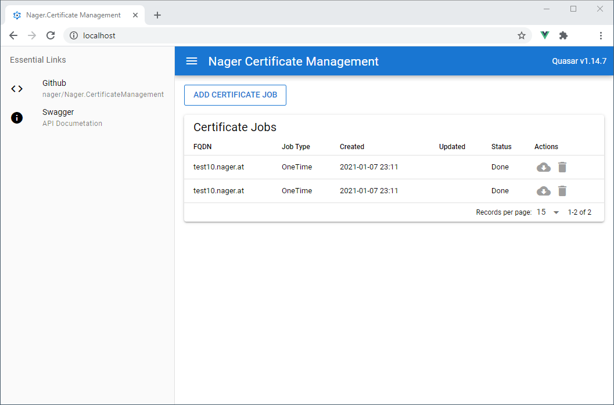

# Nager.CertificateManagement

Nager.CertificateManagement provides Lets Encrypt certificates for internal servers, switches etc.. The certificates are requested via the [DNS challenge](https://letsencrypt.org/docs/challenge-types/#dns-01-challenge), so the internal servers do not need an external connection. The docker image is available via [dockerhub](https://hub.docker.com/r/nager/nager-certificatemanagement)

## Management Portal


## Architecture Overview
<br>
The certificates can then be obtained by the individual servers from the S3 storage. In contrast to other solutions, the access data for the servers does not have to be stored at a central location. S3 policies can also ensure that each system can only query its certificate.

## Supported DNS Provider

- Hetzner
- CloudFlare

## Start Application

Update the configuration in the `docker-compose.yml` file before start the application.
After the start the application is available under http://localhost

```
LETSENCRYPT__EMAIL: your@email.com
LETSENCRYPT__REQUESTMODE: TEST OR PRODUCTION
DNSPROVIDER__HETZNER__APIKEY: APIKEY OF THE PROVIDER
DNSPROVIDER__CLOUDFLARE__APIKEY: APIKEY OF THE PROVIDER
```

```bash
docker-compose up
```

Update application

```bash
docker-compose pull
```

## Alternative and interesting projects on this topic

| Language | Project |
| ------------- | ------------- |
| Python | [lexicon](https://github.com/AnalogJ/lexicon) |
| .NET | [certify](https://github.com/webprofusion/certify) |
| GO | [lego](https://github.com/go-acme/lego) |
| PowerShell | [Posh-ACME](https://github.com/rmbolger/Posh-ACME) |
