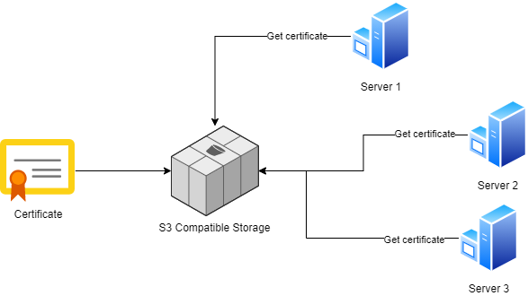

# Nager.CertificateManagement




## Supported DNS Provider

- Hetzner
- CloudFlare

## Start Application

Update the configuration in the `docker-compose.yml` file before start the application.
After the start the application is available under http://localhost

```bash
docker-compose up
```

Update application

```bash
docker-compose pull
```
